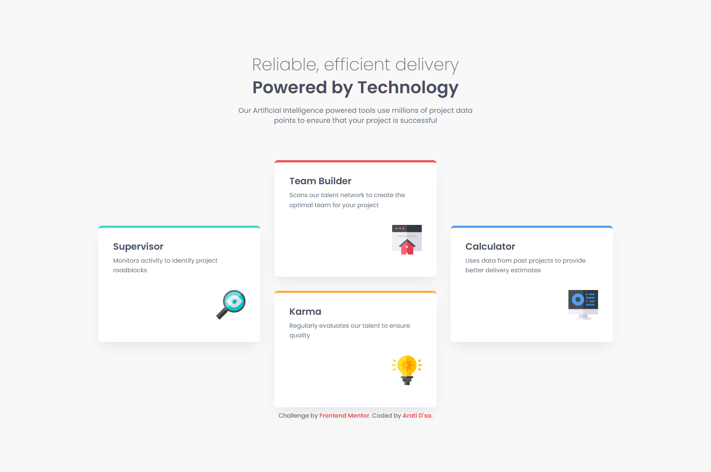
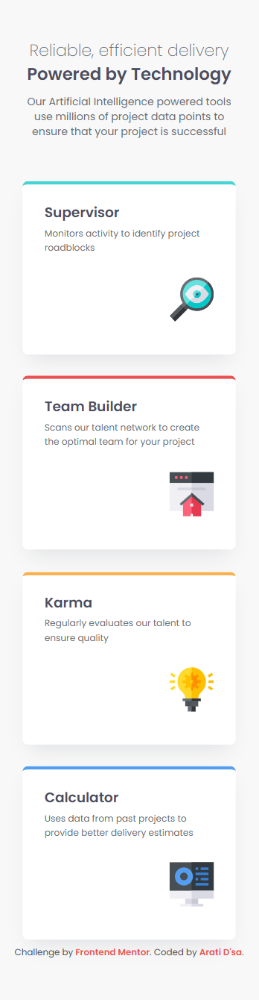

  

<h1 align="center">
  🌟Four Card Feature Section
</h1>

A responsive solution to the Four Card Feature Section challenge on Frontend Mentor.

<h3 align="center">
  🌐 <a href="https://codecove01-netizen.github.io/Four-Card-Feature-Section/">Live Demo</a>
  &nbsp;|&nbsp;
  📂 <a href="https://github.com/codecove01-netizen/Four-Card-Feature-Section">Source Code</a>
  &nbsp;|&nbsp;
  🎯 <a href="https://www.frontendmentor.io/challenges/four-card-feature-section-weK1eFYK">Challenge</a>
</h3>

 

  
  &nbsp;&nbsp;
  
  &nbsp;&nbsp;
  

<h1 align="left">
  📸 Layout Overview
</h1>

<h3 align="center">💻 Desktop View</h3>

  

 

<h3 align="center">📱 Mobile View</h3>

  

---
## 🚀 Built With

  
  
  
  
  

- Semantic HTML5
- CSS Custom Properties
- CSS Grid
- Flexbox
- Mobile-First Workflow
- Fluid Typography with clamp()

---

<h2 align="left">🛠️ Tools Used</h2>

  
  
  
  

---
## 💡 What I Learned

While building this project, I gained more confidence working with CSS Grid. Instead of relying on positioning tricks, I used `grid-template-areas` to create the desktop card arrangement, which made the layout easier to understand and maintain.

I also practiced:

- Creating a mobile-first responsive layout
- Using CSS custom properties for colors, typography, and spacing
- Applying `clamp()` to make headings scale smoothly across screen sizes
- Centering and aligning elements with Grid
- Building a clean card component with reusable styles
- Improving semantic HTML structure with `main`, `header`, and `section` elements
---

## 🎯 The Challenge

- Build out this Four Card Feature Section and get it looking as close to the design as possible.
- Users should be able to:
  1. View the optimal layout depending on their device's screen size
- Try estimating the time it will take for you to build the project. Then see if the time taken matches up to your estimate.
---

## ⏱️ Time Estimation

- Estimated time: 2 hours
- Actual time: 2 hours 15 minutes
- Most of the additional time was spent refining the responsive grid layout and matching the spacing and typography to the design.
---
<h2 align="left">🌐 Connect With Me</h2>

  
&nbsp;&nbsp;
  
&nbsp;&nbsp;
  

---

## 🙏 Acknowledgments

Thanks to **Frontend Mentor** for providing practical challenges that help developers strengthen their frontend skills through hands-on learning.
